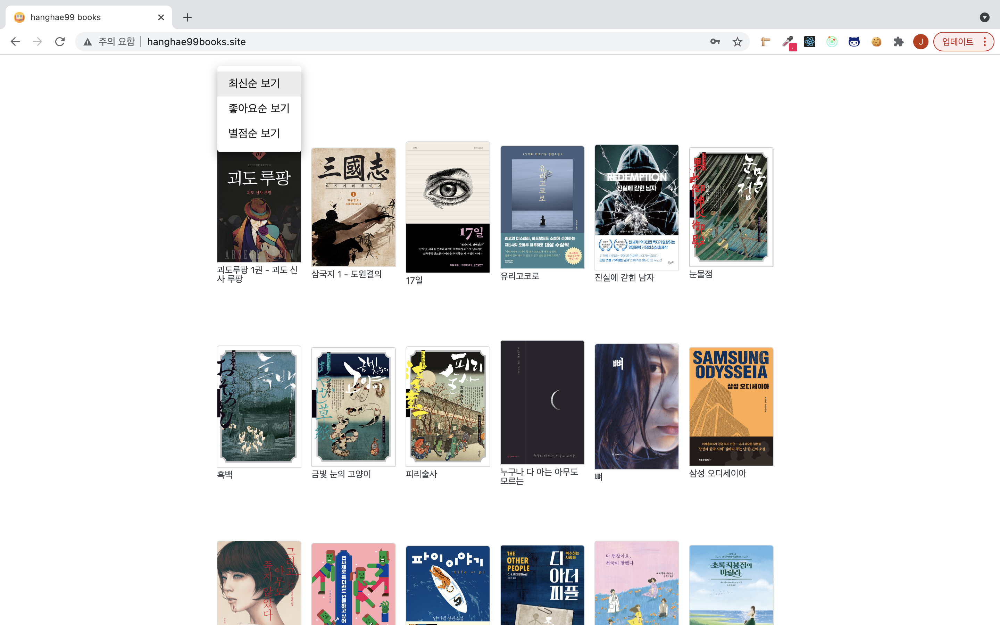
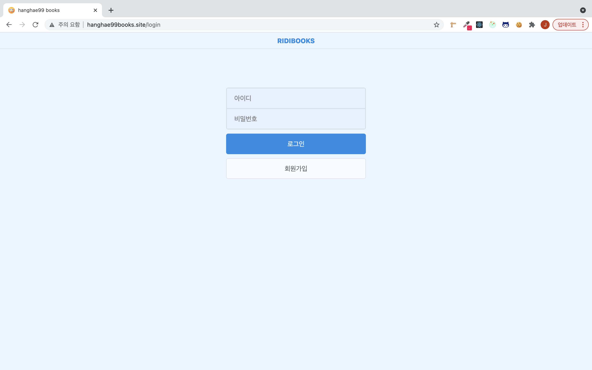
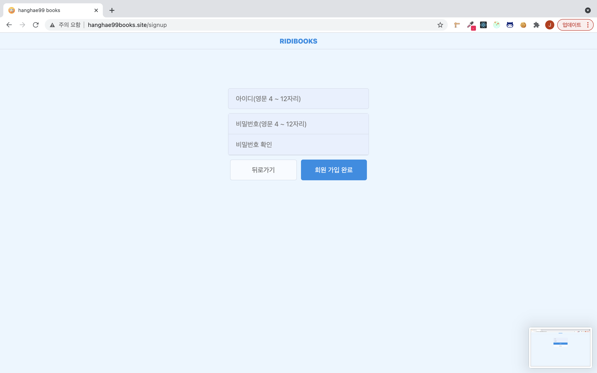
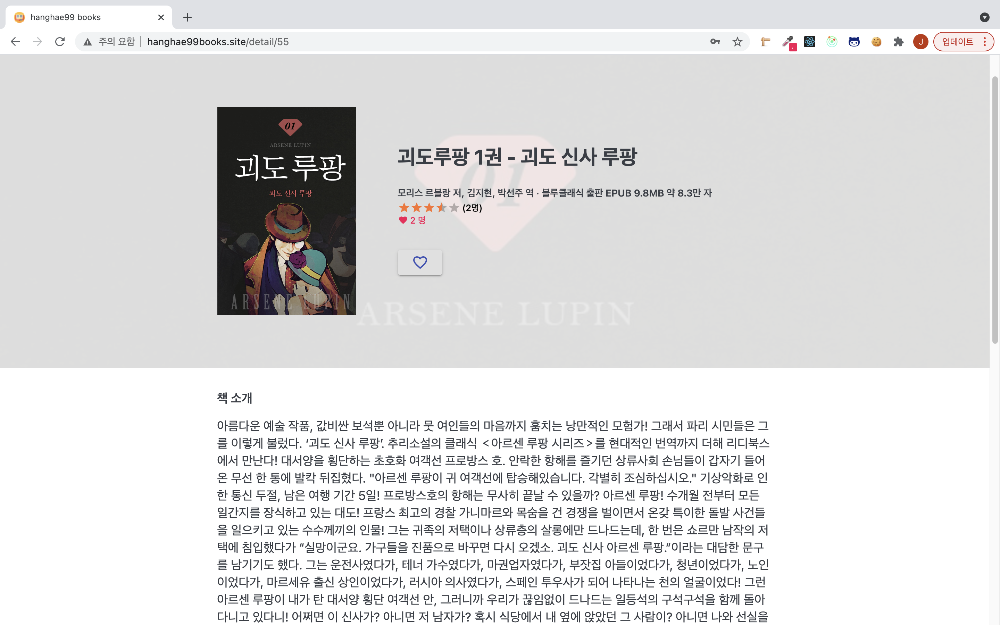
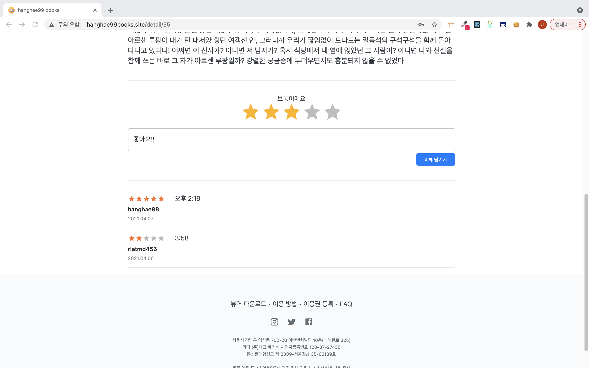

# hanghae99_books

**팀 프로젝트의 프론트 엔드 Repository 입니다.**

[백엔드 Repositroy](https://github.com/seongbinko/hanghae99_books)

## 프로젝트 특징

* React, Spring을 기반으로 기존의 서비스를 클론 코딩

  * [리디셀렉트](https://select.ridibooks.com/home): 콘텐츠를 구독하거나 책에 대한 리뷰를 남길 수 있는 서비스

* 선정한 서비스의 디자인, 테마를 HTML, SCSS로 클론

  * 모바일, 태블릿 반응형 디자인

* 프론트엔드와 백엔드를 분리하여 프로젝트 개발

  * 각 파트의 별도 Repository를 생성 후 작업
  * 프론트 : AWS S3 정적 호스팅
  * 백엔드 : AWS EC2 서버 호스팅
  * 빌드 후, S3와 EC2 연동

* 회원가입, 로그인 및 컨텐츠에 대한 CRUD 중점으로 구현

* 로그인

  * JWT 토큰, 로컬스토리지 활용

* CRUD 구현

  * RestAPI 방식
  * DB에 존재하는 서적에 대한 전체, 좋아요 순, 별점 순 조회
  * 별점 부여 및 리뷰 작성, 조회, 수정, 삭제
  * 서적에 좋아요 하기, 좋아요 취소

* 페이징 처리

  * 웹 사이트 진입시, 백엔드에게 서적 목록을 요청
  * 백엔드가 응답한 서적 목록 정보 및 총 서적 수, 페이지 수를 리덕스에 저장
  * 리덕스에 저장된 정보를 기반으로 사이트 메인 페이지 하단에 페이징 처리
  * DB 서적 목록 실시간 반영
  * 사용자가 클릭한 페이지에 해당하는 서적 목록을 서버에게 요청
  * 페이지 끝, 시작으로 가기 및 10페이지 단위 이동 기능

  

## 개요

* 명칭 : hanghae99_books
* 개발 인원 : 4명
* 개발 기간 : 2021.04.02 ~ 2021.04.08
* 주요 기능 : 서적 조회(카테고리 별), 회원 가입 및 로그인, 리뷰(작성, 조회, 수정, 삭제)
* 개발 언어 : JavaScript
* 개발 라이브러리 : React.js
* 형상 관리 툴 : git
* 협업 툴 : Slack
* 간단 소개 : 리디 셀렉트의 서적 리뷰 서비스를 클론한 프로젝트
* 사이트 : [hanghae99_books](http://hanghae99books.site/)
* 시연 영상 : [유튜브  링크](https://youtu.be/U8rmn8h4lPw)

## 개발 타임라인

**프로젝트를 진행하며 기록한 [TIL](https://github.com/greedysiru/TIL/tree/main/hanghae99) 및 [일지](https://greedysiru.tistory.com/category/이모저모/항해99%20일지) 기반의 타임라인**

| 일자       | 진행 목록                                                    |
| ---------- | ------------------------------------------------------------ |
| 2021.04.02 | 클론 서비스 선정 [ API 구상(초안)](https://docs.google.com/spreadsheets/d/14dzd7AIT8R0XmBXdqJpmf3p8h0dSwBAPmi3kCuonuSo/edit#gid=0) 프론트/백엔드 Repository 생성 |
| 2021.04.03 | 크롤링 완료 API 구상 회의(구체화) 메인, 로그인, 회원가입 페이지 뷰 완료 통신방식 공부(fetch, axios) 프론트엔드에서 사용할 패키지 선정 |
| 2021.04.04 | 상세페이지 뷰 완료 리덕스 세팅 완료 로그인, 회원가입 세팅 완료 AWS S3 버킷 업로드를 위한 기본 세팅 |
| 2021.04.05 | 추후 배포를 위한 도메인 구매 AWS S3 정적 호스팅 세팅 완료 빌드 후 AWS S3 업로드 페이지네이션 기본 세팅 완료 도메인 연동 S3, EC2 연동 확인 로그인, 회원가입 구현 완료 로그인 유지 구현 완료 API 구상 회의(구체화) 구현할 필수 기능 재정립 |
| 2021.04.06 | 메인페이지 서적 목록 조회 서버와 연동(카테고리 기능 제외) 카테고리 조회 기능 구현 완료 fetch에서 axios로 코드 변경 완료 도서 상세 조회 기능 구현 완료 리뷰 쓰기 기능 구현 완료 리뷰 목록 조회 구현 완료 도서 상세 페이지에 서버 데이터 연동 완료 리덕스 최적화 렌더링 문제 해결 |
| 2021.04.07 | 리뷰 수정 기능 구현 완료 리뷰 삭제 기능 구현 완료 좋아요 기능 구현 완료 좋아요, 별점 서버 데이터 UI와 연동 모든 페이지 디자인 완료 메타 이미지, 타이틀 적용 완료 페이지네이션 알고리즘 수정 및 기능 개선 완료 material UI Rating 로딩 문제 해결 리뷰 작성, 수정, 삭제 시 실시간 새로고침 적용 |
| 2021.04.08 | 사용성 점검 및 개선 구현한 기능 최적화 오류 방지 코드 추가 사용자 편의 기능 추가(엔터키 로그인, 메인페이지 링크 추가 등) 반응형 디자인 적용 완료(휴대폰, 태블릿 환경) 회원가입 유효성 검사 추가 리뷰 CRUD 확인 창 추가 배포전 마지막 테스트 최종 배포 |

## Contents

### 메인 페이지

### 로그인 및 회원가입 페이지

### 도서 상세 정보 페이지

### 리뷰 리스트 및 리뷰 작성 폼

## License

### MIT

## Reference

* favicon, meta 이미지 출처
  * https://www.flaticon.com/

https://facebook.github.io/create-react-app/docs/troubleshooting#npm-run-build-fails-to-minify)
